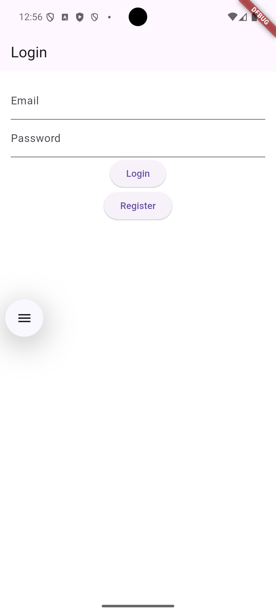
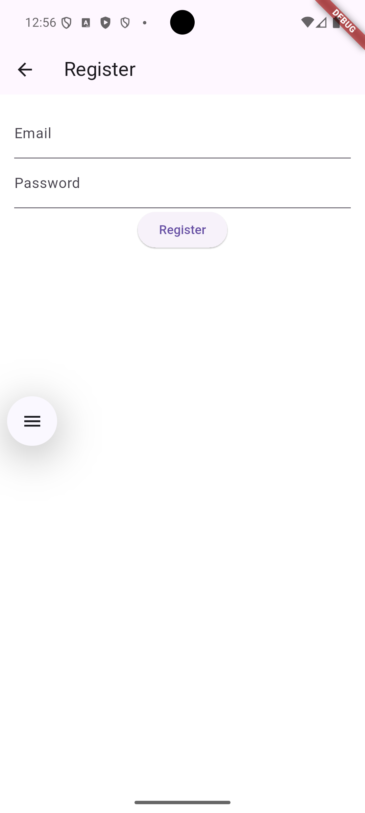
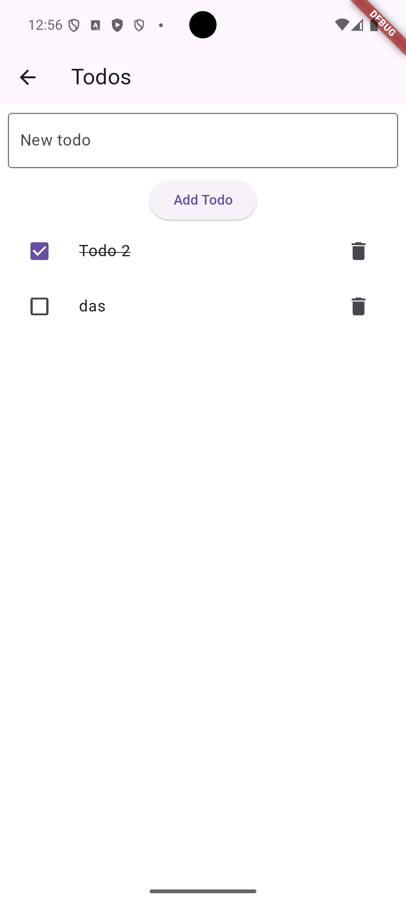

# Flutter Clean Architecture MVVM Boilerplate

A clean and modular Flutter boilerplate project using **Clean Architecture**, **MVVM**, and **GetIt** for dependency injection.

This template includes working examples for:

- ✅ User Login
- ✅ User Registration
- ✅ Todo List (Create, Toggle, Delete)

---

## 🚀 Features

- 🧠 MVVM (Model-View-ViewModel) separation
- 🏛️ Clean Architecture folder structure
- 🔁 `get_it` for dependency injection
- 📦 `go_router` for routing
- ✅ Provider for state management


---

## 📁 Project Structure

```
lib/
├── core/                    # Core modules (DI, routing, enums, utils)
├── data/                    # Data layer (models, datasources, repositories)
│   ├── datasources/
│   ├── models/
│   └── repositories/
├── domain/                  # Business logic layer
│   ├── entities/
│   ├── repositories/
│   └── usecases/
├── presentation/            # UI layer
│   ├── views/
│   │   ├── auth/
│   │   └── todo/
│   └── view_models/
│       ├── auth/
│       └── todo/
└── main.dart                # App entry point
```

---


## 🛠️ Technologies

| Package              | Purpose                    |
|----------------------|----------------------------|
| `get_it`             | Dependency injection       |
| `provider`           | State management           |
| `go_router`          | Declarative routing        |

---

## 🧪 Getting Started

```bash
git clone https://github.com/huseyiniriss/flutter_clean_architecture_mvvm_boilerplate.git
cd flutter_clean_architecture_mvvm_boilerplate
flutter pub get
flutter run
```

---

## 📌 Example Use Cases

- ✅ Authentication-based apps
- ✅ Simple CRUD operations
- ✅ Learning clean architecture in Flutter
- ✅ Scalable codebase for MVPs

---

## 📷 Screenshots

> 
> 
> 

---

## 📄 License

This project is licensed under the MIT License.

---

## 🙋‍♂️ Author

Developed by [huseyiniriss](https://github.com/huseyiniriss)
